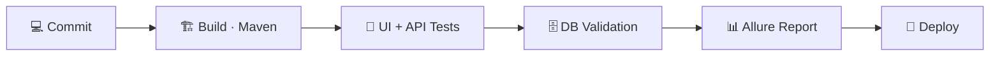

<!-- ============================================================
     Profile README: SahanRathnaweera/Sahan-Rathnaweera
     Search for "TODO" and replace those bits with your own details.
     ============================================================ -->

<div align="center">


<a href="https://git.io/typing-svg">
  
</a>

<br/><br/>


<br/><br/>


</div>


<div align="center">
  
</div>

```java
public class SahanRathnaweera implements SoftwareEngineer, QEAutomationEngineer {

    private final String location = "Sri Lanka 🇱🇰";
    private boolean alive = true;

    private final String[] build = { "Java", "Spring Boot", "React", "Vite", "PostgreSQL", "MySQL" };
    private final String[] test  = { "Selenium", "REST Assured", "TestNG", "Cucumber", "Allure" };

    public void dailyRoutine() {
        while (alive) {
            buildFeature();
            writeAutomatedTests();
            fixFlakyTest();        
            learnSomethingNew();
        }
    }
}
```

- 🌱 **Currently:** TODO (e.g. building a full-stack project / learning Playwright / preparing for ISTQB)
- 🔍 **Mindset:** Write code that's easy to test, and write tests that are easy to maintain
- 📫 **Reach me:** [LinkedIn](https://www.linkedin.com/in/TODO) · [Email](mailto:TODO@example.com)


<div align="center">
  
</div>

<table>
<tr>
<td width="50%" valign="top" align="center">

### 👨‍💻 Software Engineering


<br/>


</td>
<td width="50%" valign="top" align="center">

### 🧪 QE Automation


<br/>


</td>
</tr>
</table>

<div align="center">

### ⚙️ DevOps & Tools


</div>


<div align="center">
  
</div>

| 👨‍💻 Software Engineering | 🧪 QE Automation |
|---|---|
| Design & build **REST APIs** with Spring Boot | Design **scalable test frameworks** (Page Object Model, data-driven) |
| Build responsive UIs with **React + Vite** | Automate **UI tests** with Selenium / Playwright |
| Model & query data in **PostgreSQL / MySQL** | Validate **APIs** with REST Assured / Postman |
| Manage DB schemas & queries with **pgAdmin 4** | Verify **data integrity** with SQL checks against the DB |
| Clean code, layered architecture, Git workflow | Run suites in **CI (GitHub Actions / Jenkins)** with Allure reports |




<div align="center">
  
</div>

<!-- TODO: replace these with your real projects and links.
     Optional: swap the table for pin cards, one per project:
     <a href="https://github.com/SahanRathnaweera/REPO_NAME">
       
     </a>
-->

| Project | Description | Tech |
|---|---|---|
| 🔗 **[TODO: Full-stack project](https://github.com/SahanRathnaweera)** | TODO: one line about what it does (e.g. inventory / booking / e-commerce app) | `Java` `Spring Boot` `React` `Vite` `PostgreSQL` |
| 🔗 **[TODO: Test automation framework](https://github.com/SahanRathnaweera)** | TODO: one line (e.g. UI + API automation with reports and CI pipeline) | `Java` `Selenium` `TestNG` `REST Assured` `Allure` |


<div align="center">
  


<br/><br/>

<a href="https://github.com/SahanRathnaweera?tab=followers">
  
</a>
</div>


<div align="center">
  

<picture>
  <source media="(prefers-color-scheme: dark)" srcset="https://raw.githubusercontent.com/SahanRathnaweera/Sahan-Rathnaweera/output/github-contribution-grid-snake-dark.svg" />
  <source media="(prefers-color-scheme: light)" srcset="https://raw.githubusercontent.com/SahanRathnaweera/Sahan-Rathnaweera/output/github-contribution-grid-snake.svg" />
  
</picture>
</div>


<div align="center">

### 🤝 Let's Connect

[](https://www.linkedin.com/in/sahan-tharuka-28066436b)
[](mailto:TODO@example.com)
[](https://github.com/SahanRathnaweera)

> *"Ship fast, but never ship broken."*


</div>
